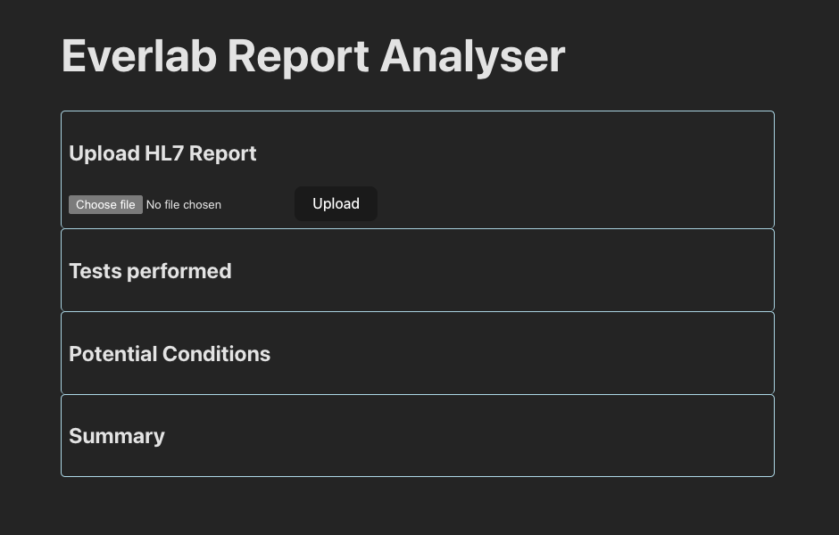
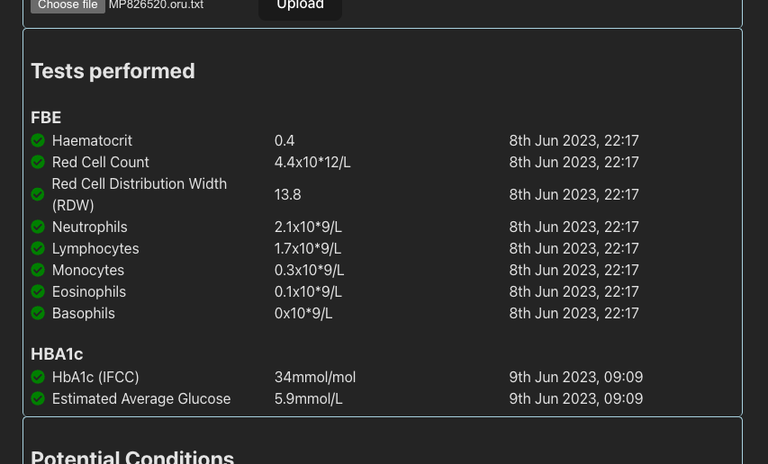
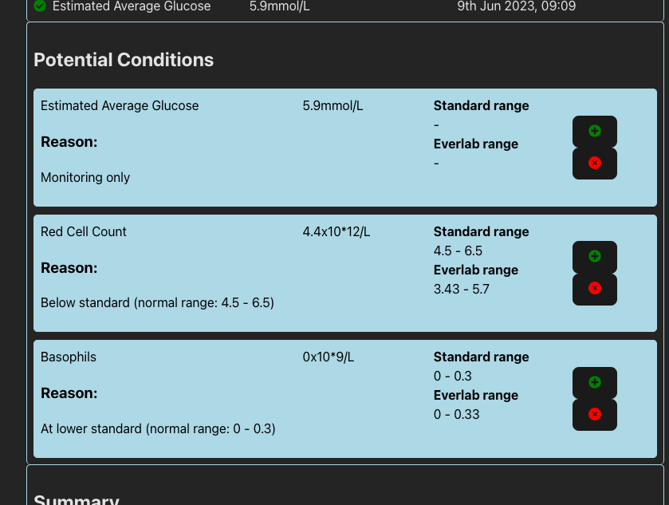
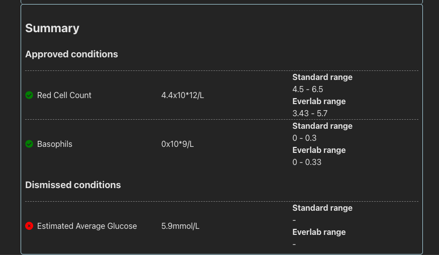
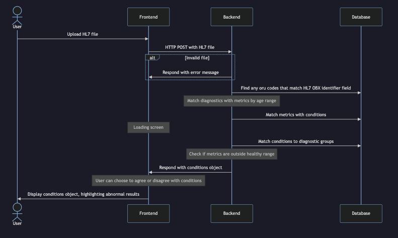

# Everlab Report Analyser

This is the frontend of the Everlab Report Analyser. It is a web application that allows users to upload pathology reports and view the results of the analysis.

To begin, clone the repository. Navigate to `svc-condition-report` (backend) and run `yarn`, then `yarn build`.
Then navigate to `pathology-report-upload` (frontend) and run `yarn`.

Now you should be able to run `docker-compose up` in the root directory. This will start the backend server and postgres database. May need to be run the command again if the postgres container restarts itself, which causes the backend container to crash.

Once docker is running, navigate to the `pathology-report-upload` directory and run `yarn dev` to start the frontend server locally.

## Usage

1. Navigate to the web application running locally
   
2. Click `Choose File` and select a pathology report to upload. Then click `Upload`
3. Upon successful upload, the report will be displayed showing all tests that have been performed grouped by diagnostic category.
   
4. A list of potential conditions are listed, based on results that fall outside the standard or everlab expected ranges. Each condition can be either approved, or dismissed.
   
5. Approved and dismissed conditions are displayed in the `Summary` section
   

## Solution Diagram

