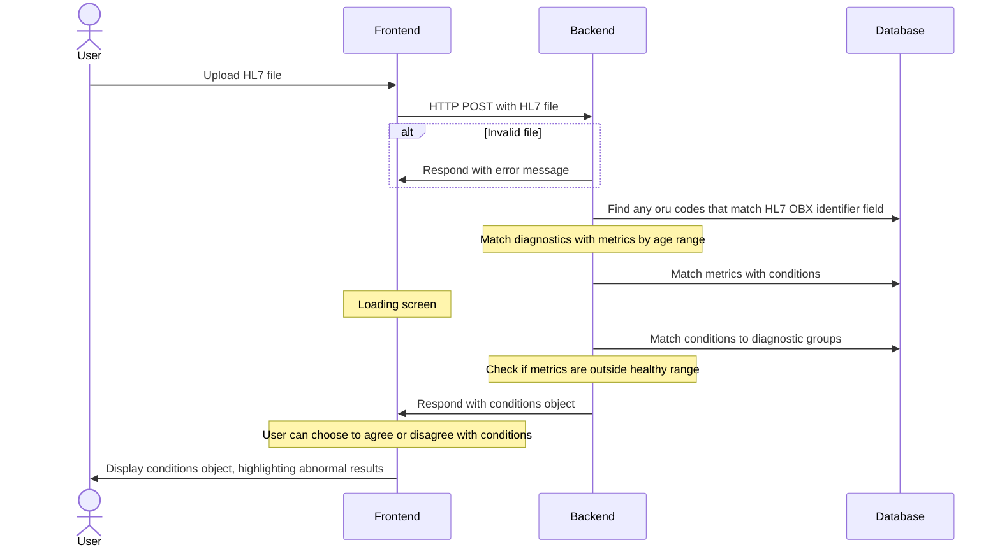

```mermaid
sequenceDiagram
    actor User
    participant Frontend
    participant Backend
    participant DB as Database
    User->>Frontend: Upload HL7 file
    Frontend->>Backend: HTTP POST with HL7 file
    alt Invalid file
        Backend->>Frontend: Respond with error message
    end
    Backend->>DB: Find any oru codes that match HL7 OBX identifier field
    Note over Backend: Match diagnostics with metrics by age range
    Backend->>DB: Match metrics with conditions
    Note over Frontend: Loading screen
    Backend->>DB: Match conditions to diagnostic groups
    Note over Backend: Check if metrics are outside healthy range
    Backend->>Frontend: Respond with conditions object
    Note over Frontend: User can choose to agree or disagree with conditions
    Frontend->>User: Display conditions object, highlighting abnormal results
```
